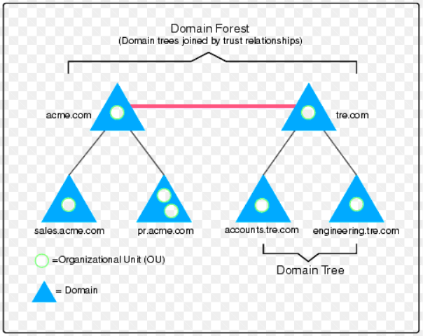

# Introduction to Active Directory

### What is Active Directory

Active Directory stores information about objects on the network and makes this information easy for administrators and users to find and use. Active Directory uses a structured data store as the basis for a logical, hierarchical organization of directory information.This data store, also known as the directory, contains information about Active Directory objects. These objects typically include shared resources such as servers, volumes, printers, and the network user and computer accounts. Simply, Active Directory (AD) is a Microsoft technology used to manage computers and other shared resources on a network and it can be used for centralized management of authentication and authorization.

As I said Everything is considered as an object in Active Directory. Below is a diagram of an Active Directory objects:&#x20;

<figure><figcaption></figcaption></figure>

### Components of Active Directory

Active Directory also includes:

1. A set of rules, the **schema**, that defines the classes of objects and attributes contained in the directory, the constraints and limits on instances of these objects, and the format of their names.
2. A **global catalog** that contains information about every object in the directory. This allows users and administrators to find directory information regardless of which domain in the directory actually contains the data.
3. A **query and index mechanism**, so that objects and their properties can be published and found by network users or applications.
4. A **replication service** that distributes directory data across a network. All domain controllers in a domain participate in replication and contain a complete copy of all directory information for their domain. Any change to directory data is replicated to all domain controllers in the domain.

### Structure of Active Directory

The Structure of an Active Directory can be explained as:

1. **Organizational Units**: Organizational Unit is used to manage users, groups, workstations, and other functional units.
2. **Domain**: Domain is a group of users, computers and other Active Directory objects that share the same AD database.
3. **Tree**: Domain tree is a collection of one or multiple domains grouped together in a hierarchical parent-child structure.
4. **Forest**: Forest is a group of multiple trees with shared directory schemas, catalogs, application information and domain configurations.

<figure><figcaption></figcaption></figure>

### References

References for Day-2

1. [https://learn.microsoft.com/en-us/windows-server/identity/ad-ds/get-started/virtual-dc/active-directory-domain-services-overview](https://learn.microsoft.com/en-us/windows-server/identity/ad-ds/get-started/virtual-dc/active-directory-domain-services-overview)
